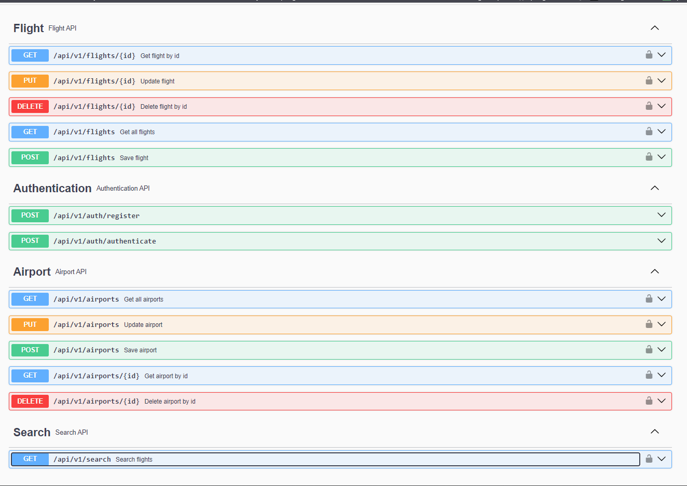

# Flight Search API
This project includes a backend API developed for a flight search application.

## Features
* User registration and login with JWT authentication
* Password encryption using BCrypt
* Role-based authorization with Spring Security
* Customized access denied handling
* CRUD operations for flights
* CRUD operations for airports
* Search flights by departure and destination airports
* Fetch flights from the ERP system

## Technologies
* Spring Boot 3.0
* Spring Security
* JSON Web Tokens (JWT)
* Spring Data JPA
* Lombok
* Maven
* Swagger

## Notes
* All the endpoints are secured with JWT authentication. To access the endpoints, you need to register and login first.
  * There are two roles: ADMIN and USER. ADMIN role is required to access the endpoints for POST, PUT, DELETE operations.
* Domain Driven Design (DDD) is used to design the project structure.
* The scheduled task to fetch flights every day from the ERP system is implemented with Spring Scheduler.

## Getting Started
To get started with this project, you will need to have the following installed on your local machine:

* JDK 17+
* Maven 3+

To build and run the project, follow these steps:

* Clone the repository: `git clone https://github.com/yabdioglu/spring-boot-flight-search-api.git`
* Navigate to the project directory: cd spring-boot-flight-search-api
* Build the project: mvn clean install
* Run the project: mvn spring-boot:run

-> The application will be available at http://localhost:8080.
-> The API documentation will be available at http://localhost:8080/swagger-ui.html

## API Preview
